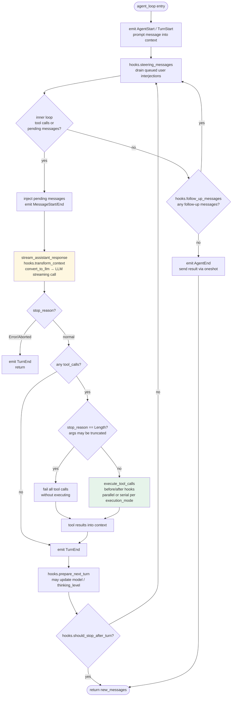
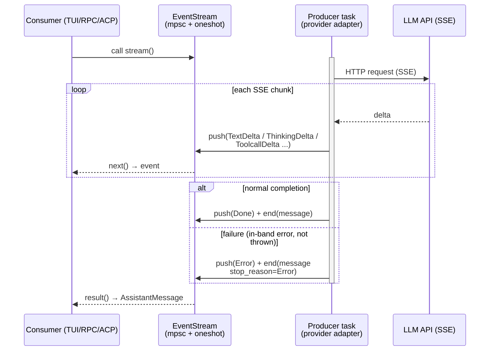
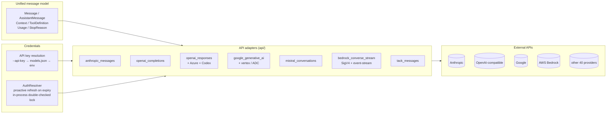
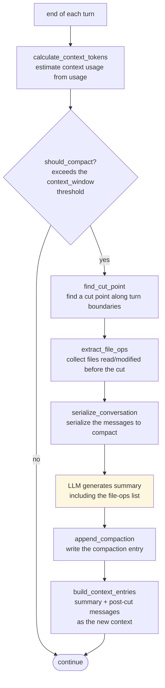
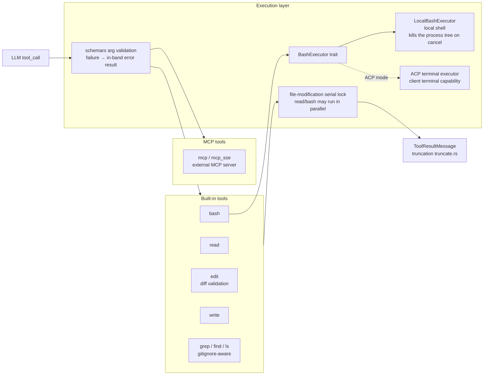
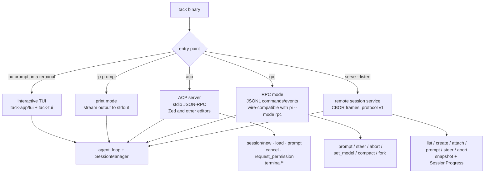
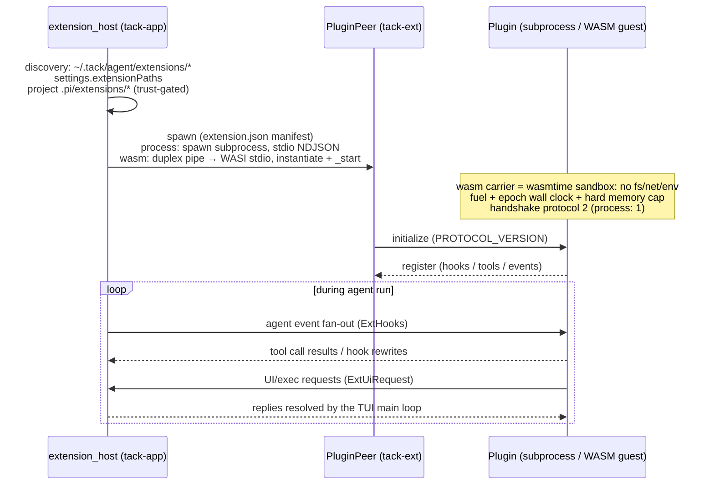
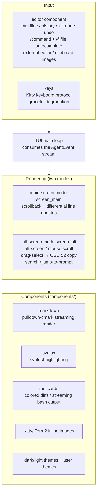
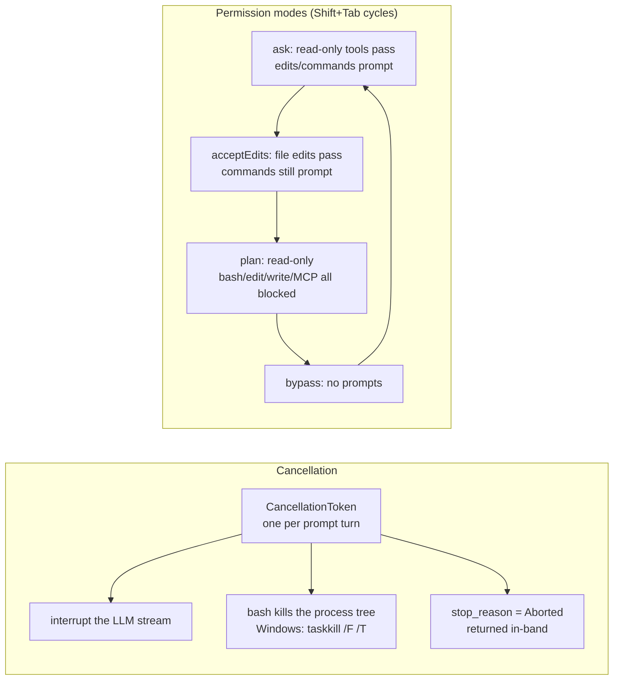

# Tack Architecture

**English | [简体中文](architecture.zh-CN.md)**

Tack is a Rust reimplementation of the TypeScript pi coding-agent core: headless
at its core, with an interactive TUI, ACP (Agent Client Protocol) editor
integration, and RPC and remote-session services.

## 1. Overall Architecture

Crates are layered with an acyclic dependency direction: `tack-ai ← tack-agent-core ← tack-tools`,
`tack-ai ← tack-session`, `tack-app → all crates`.

```mermaid
flowchart TB
    subgraph App["tack-app (binary)"]
        CLI[CLI / clap arg parsing]
        TUI[interactive TUI<br/>tui/]
        PRINT[print mode<br/>one-shot headless run]
        ACP[acp subcommand<br/>ACP server over stdio]
        RPC[rpc subcommand<br/>JSONL protocol over stdio]
        SERVE[serve subcommand<br/>CBOR remote sessions]
        EXTHOST[extension_host<br/>plugin discovery & lifecycle]
        MISC[settings / skills /<br/>system_prompt / auth]
    end

    subgraph Core["Core layer"]
        AGENT[tack-agent-core<br/>agent_loop / AgentEvent /<br/>AgentHooks / Extension / AgentTool]
        SESSION[tack-session<br/>JSONL v3 session persistence (tree)<br/>compaction context compression]
        TOOLS[tack-tools<br/>read / bash / edit / write /<br/>grep / find / ls / MCP]
    end

    subgraph AI["tack-ai (model layer)"]
        MSG[unified message model<br/>types / transform]
        ADAPTERS[API adapters<br/>Anthropic / OpenAI Completions /<br/>OpenAI Responses / Azure / Codex /<br/>Google / Vertex / Mistral / Bedrock / tack-messages]
        OAUTH[oauth<br/>PKCE / device flow<br/>AuthResolver proactive refresh]
        REG[providers registry<br/>40 providers / 1130-model catalog]
    end

    subgraph Infra["Infrastructure layer"]
        PROTO[tack-protocol<br/>CBOR schemas / framing<br/>RemoteClient]
        TUILIB[tack-tui<br/>terminal UI library<br/>components / markdown / syntax highlighting<br/>main-screen + alt-screen renderers]
        EXT[tack-ext<br/>subprocess plugin protocol<br/>NDJSON over stdio]
    end

    CLI --> TUI & PRINT & ACP & RPC & SERVE
    TUI --> TUILIB
    PRINT & ACP & RPC & SERVE --> AGENT
    TUI --> AGENT
    EXTHOST --> EXT
    AGENT --> MSG
    TOOLS --> AGENT
    SESSION --> AGENT
    AGENT --> ADAPTERS
    ADAPTERS --> MSG
    ADAPTERS --> OAUTH
    REG --> ADAPTERS
    SERVE --> PROTO
    EXT -.NDJSON.-> EXTHOST

    style App fill:#e8f0fe
    style Core fill:#e6f4ea
    style AI fill:#fef7e0
    style Infra fill:#fce8e6
```

Key design decisions:

- **Streaming**: `EventStream<T, R>` (tokio mpsc event queue + oneshot final
  result); provider errors are always delivered **in-band** (`Error` event +
  `stop_reason: Error`), never thrown.
- **Tools**: the parameter boundary is `serde_json::Value` + `schemars` schema;
  validation failures become in-band error tool results. `execution_mode()`
  controls parallel/serial batches; file modifications serialize on a shared lock.
- **Hooks**: a single `AgentHooks` trait object (transform_context / before_tool_call /
  after_tool_call / steering / follow-up / next-turn).
- **Cancellation**: one `tokio_util::CancellationToken` per prompt turn; bash
  kills the whole process tree.
- **Windows**: bash resolves Git Bash (legacy WSL bash is rejected), same as TS pi.

## 2. Agent Loop (tack-agent-core)

`run_loop` is a direct port of TS `packages/agent/src/agent-loop.ts`: an outer
follow-up loop plus an inner tool-call/steering loop, with matching event
ordering and error semantics.



## 3. Streaming Event Primitives (tack-ai stream)

Every LLM call and agent run is exposed through an `EventStream`: the producer
pushes events from a dedicated tokio task, the consumer pulls them one by one
via `next()`, and finally calls `result()` for the final result.



## 4. Provider Adapter Layer (tack-ai)

The unified message model is the hub: each API adapter handles bidirectional
conversion between the unified model and the vendor wire format, and the
registry provides the model catalog and credential resolution.



## 5. Session Persistence & Branching (tack-session)

Sessions are JSONL v3 files (byte-compatible with TS pi); entries form a
**tree** via `parent_id`; `leaf_id` points to the tip of the current branch.
branch/fork simply moves the leaf pointer.

```mermaid
flowchart TD
    subgraph File["session.jsonl (one SessionLine per line)"]
        H[header<br/>version=3, session_id]
        E1[entry: user message]
        E2[entry: assistant message]
        E3[entry: tool_result]
        E4[entry: user message B]
        E5[entry: assistant B]
        E6[entry: compaction<br/>summary + cut point]
        E7[entry: model_change / label /<br/>branch_summary / session_info]
    end

    H --> E1
    E1 -->|parent_id| E2
    E2 --> E3
    E3 --> E4
    E4 --> E5
    E3 -.branch.-> E6

    subgraph Ops["SessionManager operations"]
        OP1[create / open /<br/>continue_recent / fork_from]
        OP2[append_* family<br/>append and update leaf_id]
        OP3[branch(entry_id)<br/>rewind leaf, create new branch]
        OP4[build_session_context<br/>rebuild context along the parent chain]
    end

    File --> Ops
```

## 6. Context Compaction (tack-session compaction)



## 7. Tool Execution (tack-tools)



## 8. Run Modes & Protocols (tack-app)

One binary, five entry points, all sharing the same agent core:



## 9. Extension System (tack-ext + extension_host)

Plugins come in two carriers: executable subprocesses by default
(`carrier: "process"`), or WASI p1 modules in a wasmtime sandbox
(`carrier: "wasm"`, tack-ext-wasm). Both carriers run **the same NDJSON
protocol** — the WASM carrier connects the module's stdin/stdout to an
in-memory duplex pipe handed to tack-ext's transport-agnostic `PluginPeer`,
with an identical handshake (`protocol: 2`), 30s call timeout, and fail-fast
dead-plugin semantics. WASM guests have no capabilities by default (no
fs/network/env vars); fuel / epoch wall-clock / memory limits are clamped by
the host to the values declared in the manifest. The host spawns one carrier
instance per plugin, fans out agent events, and bridges tool calls and UI
dialogs.



## 10. TUI Rendering (tack-tui + tack-app/tui)



## 11. Cancellation & Permissions


