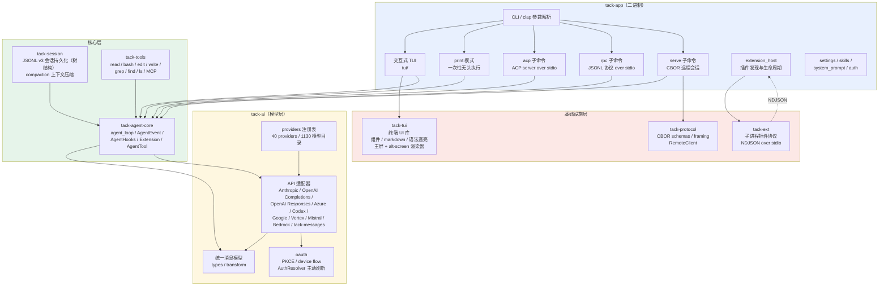
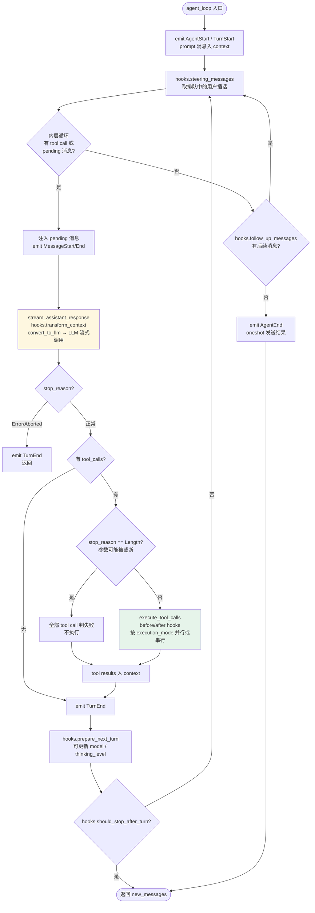
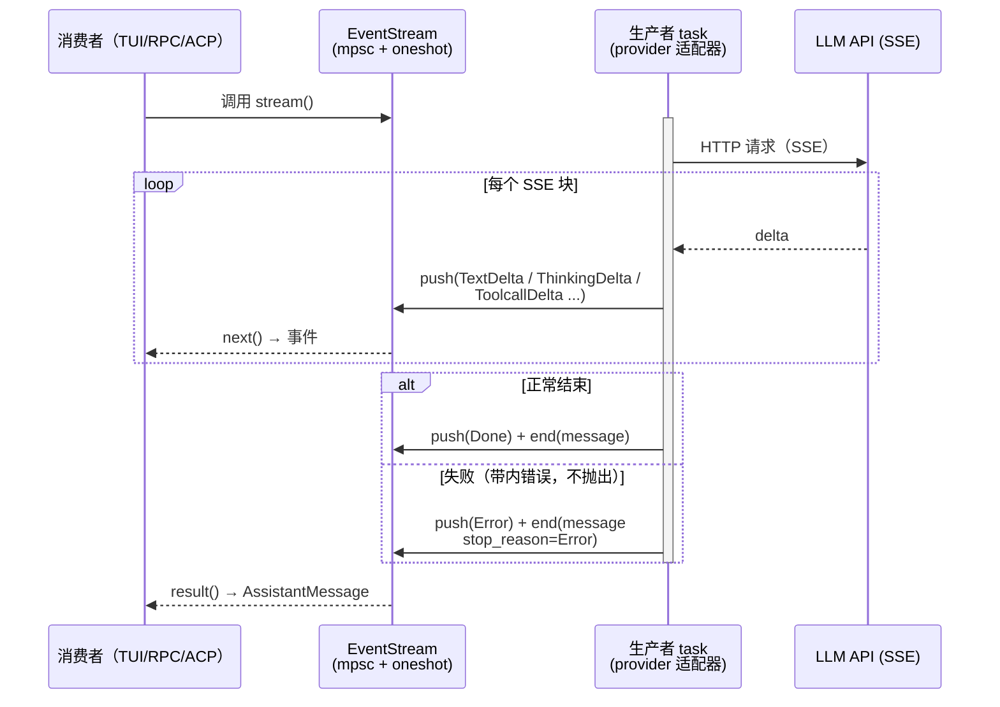
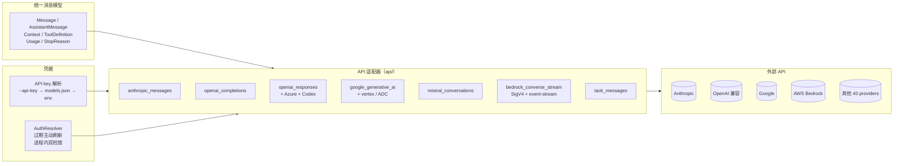
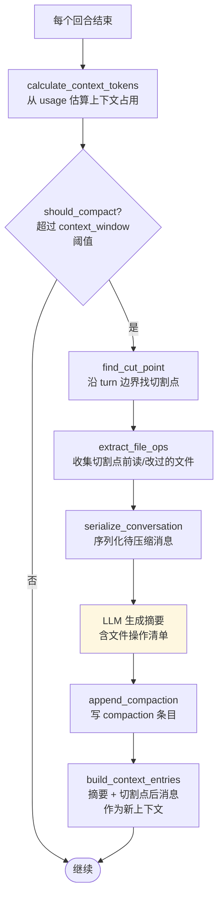
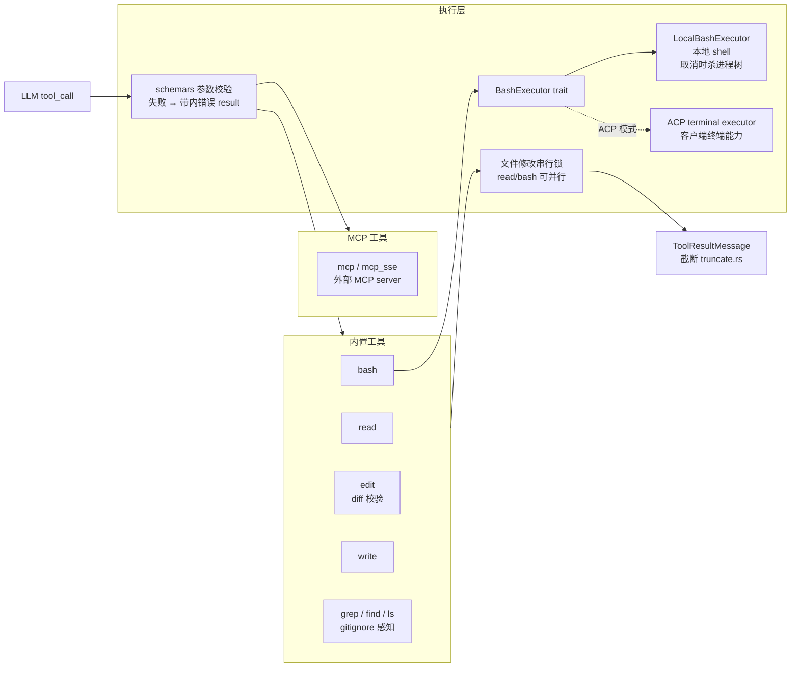
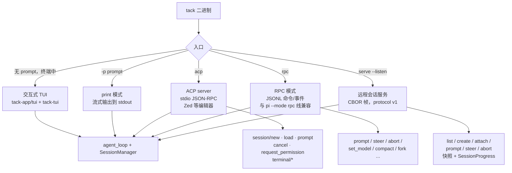
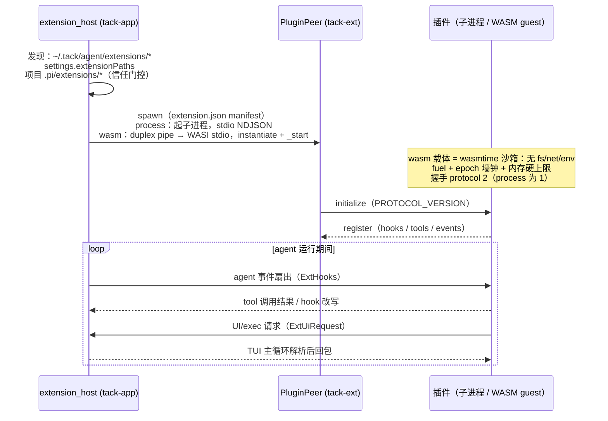
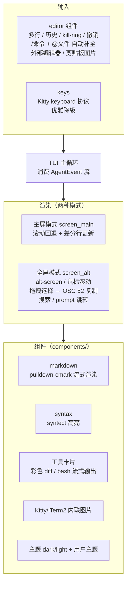
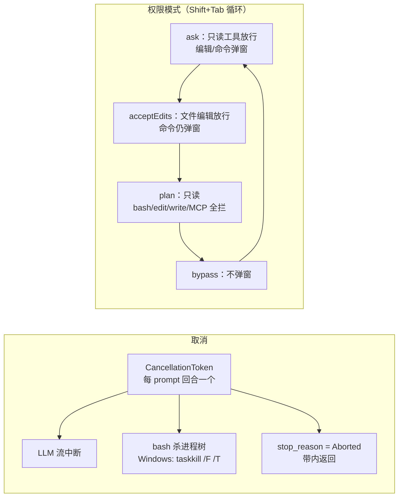

# Tack 架构设计

**[English](architecture.md) | 简体中文**

Tack 是 TypeScript pi 编码代理核心的 Rust 重实现：无头（headless）为核心，附带
交互式 TUI、ACP（Agent Client Protocol）编辑器集成、RPC 与远程会话服务。

## 1. 整体架构

crate 分层，依赖方向无环：`tack-ai ← tack-agent-core ← tack-tools`，`tack-ai ← tack-session`，
`tack-app → 所有 crate`。



关键设计决策：

- **流式**：`EventStream<T, R>`（tokio mpsc 事件队列 + oneshot 最终结果），
  provider 错误一律**带内**传递（`Error` 事件 + `stop_reason: Error`），不抛出。
- **工具**：参数边界为 `serde_json::Value` + `schemars` schema；校验失败转为带内
  错误 tool result。`execution_mode()` 控制并行/串行批次；文件修改在共享锁上串行。
- **Hooks**：单一 `AgentHooks` trait 对象（transform_context / before_tool_call /
  after_tool_call / steering / follow-up / next-turn）。
- **取消**：每个 prompt 回合一个 `tokio_util::CancellationToken`；bash 杀整棵进程树。
- **Windows**：bash 解析 Git Bash（拒绝旧版 WSL bash），与 TS pi 一致。

## 2. Agent 循环（tack-agent-core）

`run_loop` 直接移植 TS `packages/agent/src/agent-loop.ts`：外层 follow-up 循环 +
内层 tool-call/steering 循环，事件顺序与错误语义保持一致。



## 3. 流式事件原语（tack-ai stream）

每个 LLM 调用和 agent 运行都通过 `EventStream` 暴露：生产者在独立 tokio task 中
推事件，消费者逐条 `next()`，最后 `result()` 取最终结果。



## 4. Provider 适配层（tack-ai）

统一消息模型为枢纽：各 API 适配器负责「统一模型 ↔ 厂商线格式」双向转换，
注册表提供模型目录与凭据解析。



## 5. 会话持久化与分支（tack-session）

会话为 JSONL v3 文件（与 TS pi 字节兼容），条目以 `parent_id` 构成**树**；
`leaf_id` 指向当前分支末梢。branch/fork 即移动 leaf 指针。

```mermaid
flowchart TD
    subgraph File["session.jsonl（每行一条 SessionLine）"]
        H[header<br/>version=3, session_id]
        E1[entry: user message]
        E2[entry: assistant message]
        E3[entry: tool_result]
        E4[entry: user message B]
        E5[entry: assistant B]
        E6[entry: compaction<br/>摘要 + cut point]
        E7[entry: model_change / label /<br/>branch_summary / session_info]
    end

    H --> E1
    E1 -->|parent_id| E2
    E2 --> E3
    E3 --> E4
    E4 --> E5
    E3 -.branch.-> E6

    subgraph Ops["SessionManager 操作"]
        OP1[create / open /<br/>continue_recent / fork_from]
        OP2[append_* 系列<br/>追加并更新 leaf_id]
        OP3[branch(entry_id)<br/>回溯 leaf，产生新分支]
        OP4[build_session_context<br/>沿 parent 链还原上下文]
    end

    File --> Ops
```

## 6. 上下文压缩（tack-session compaction）



## 7. 工具执行（tack-tools）



## 8. 运行模式与协议（tack-app）

一个二进制，五种入口，共享同一 agent 核心：



## 9. 扩展系统（tack-ext + extension_host）

插件有两种载体：默认是可执行子进程（`carrier: "process"`），也可以是
wasmtime 沙箱中的 WASI p1 模块（`carrier: "wasm"`，tack-ext-wasm）。两种载体
跑**同一份 NDJSON 协议**——WASM 载体把模块的 stdin/stdout 接到内存 duplex
pipe，交给 tack-ext 传输无关的 `PluginPeer`，握手（`protocol: 2`）、30s 调用
超时、死插件 fail-fast 语义与子进程完全一致。WASM guest 默认无任何能力
（无 fs/网络/环境变量），fuel / epoch 墙钟 / 内存上限由 host 钳制 manifest
声明值。host 每插件起一个载体实例，转发 agent 事件并桥接 tool 调用与 UI
对话框。



## 10. TUI 渲染（tack-tui + tack-app/tui）



## 11. 取消与权限


