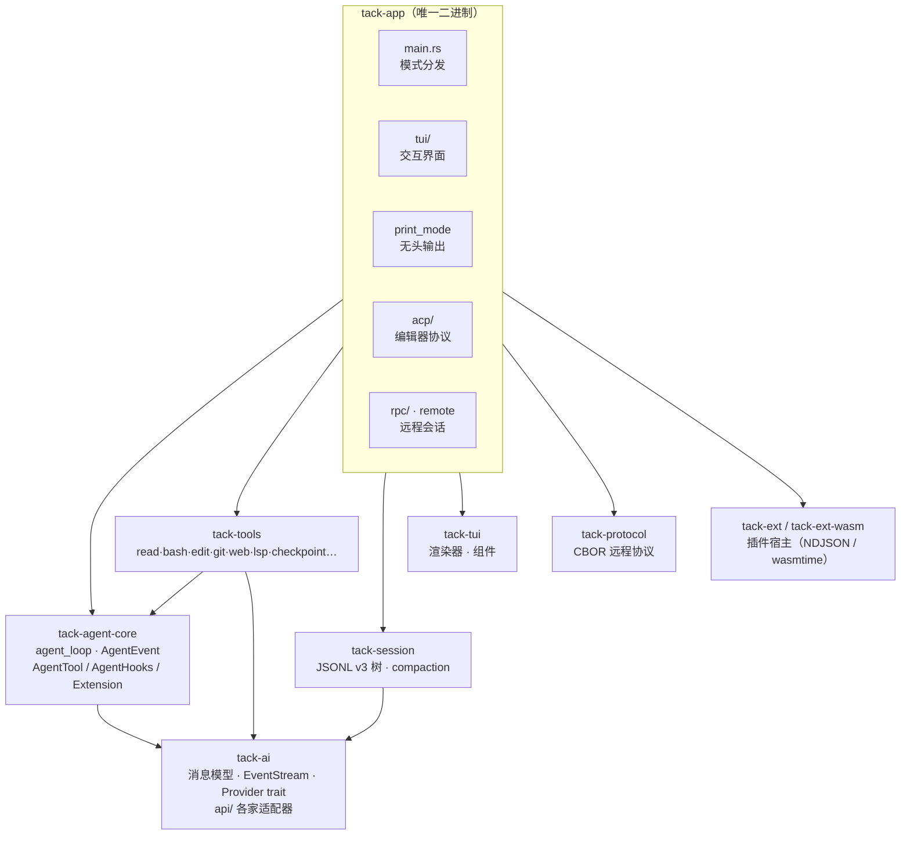
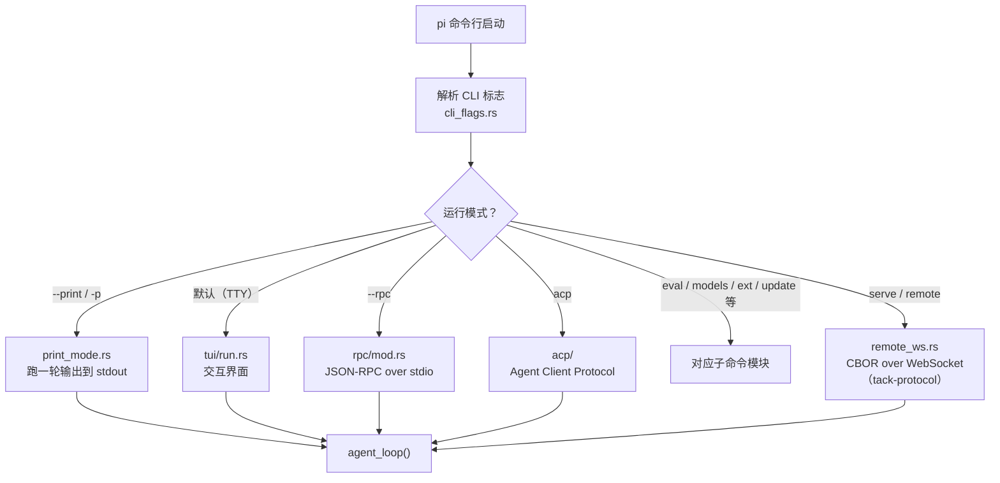
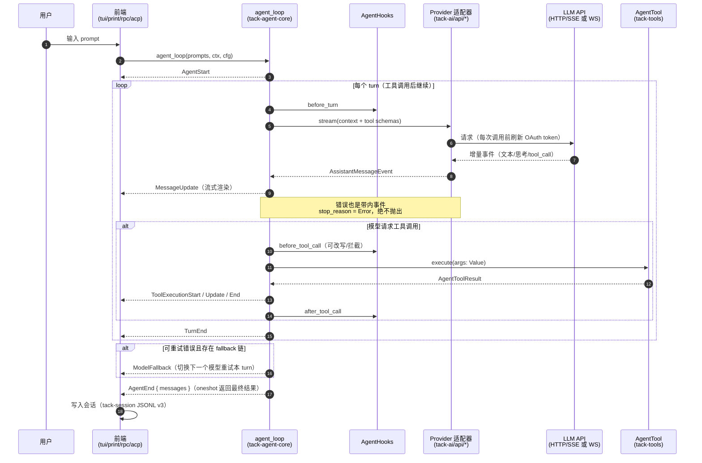
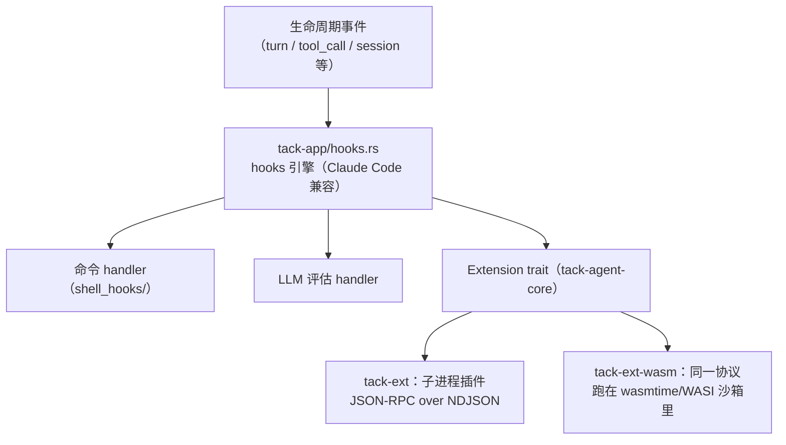

# 新人上手指引：源码阅读路线 · 功能速查 · 流程图

面向第一次接触 Tack 的开发者。读完本文你应该能回答三个问题：

1. **从哪开始读代码？** —— 按下面的"阅读路线"走，大约 1~2 天可以建立全景。
2. **某个功能的代码在哪？** —— 查"功能速查表"。
3. **运行时数据怎么流？** —— 看文末的 mermaid 流程图。

> 前提：`cargo build` 能过（rust-toolchain.toml 已钉版本）。
> 先跑一遍再读代码：`cargo run -- --print "列出当前目录文件"`（print 模式，最短全链路）。

---

## 一、30 秒全景

Tack 是 TypeScript pi coding agent 的 Rust 重实现。9 个 crate，依赖方向严格无环：

```
tack-ai（消息模型 + 各家 LLM 适配器）
   ↑
tack-agent-core（agent 主循环 + 工具/hook/扩展 trait）  ←  tack-session（会话持久化 + 压缩）
   ↑
tack-tools（内置工具集）
   ↑
tack-app（唯一二进制：TUI / print / ACP / RPC / serve 全在这里组装）

tack-tui（终端 UI 库）· tack-protocol（CBOR 远程协议）· tack-ext / tack-ext-wasm（插件宿主）
        ↑ 以上三者只被 tack-app 使用
```

**一条铁律**：全项目只有两种"流"——
- `EventStream<T, R>`（tack-ai/src/stream.rs）：tokio mpsc 增量事件 + oneshot 最终结果；
- 所有 provider 错误都是**带内错误**（`Error` 事件 + `stop_reason: Error`），绝不抛异常。

理解了这两条，剩下的都是细节。

---

## 二、源码阅读路线（按依赖自底向上）

### 第 1 站：tack-ai —— 消息模型与流（约 2 小时）

| 顺序 | 文件 | 行数 | 读什么 |
|---|---|---|---|
| 1 | `crates/tack-ai/src/types.rs` | 484 | `Message` / `AssistantMessage` / `ContentBlock` / `StopReason` / `Usage` —— 全项目的通用语言 |
| 2 | `crates/tack-ai/src/stream.rs` | 194 | `EventStream<T, R>` 的构造与消费方式 |
| 3 | `crates/tack-ai/src/provider.rs` | 105 | `Provider` trait：所有 LLM 后端的统一接口 |
| 4 | `crates/tack-ai/src/api/anthropic_messages.rs` | — | 挑一个适配器精读，看 SSE 增量事件如何翻译成 `AssistantMessageEvent` |
| 5 | 其余 `api/*` | — | 扫一遍即可：OpenAI Completions/Responses、Google、Mistral、Codex WS、Bedrock |

**自测问题**：模型边生成边调用工具时，事件顺序是什么？（提示：看 `AssistantMessageEvent` 的变体）

### 第 2 站：tack-agent-core —— 整个项目的心脏（约半天）

| 顺序 | 文件 | 行数 | 读什么 |
|---|---|---|---|
| 1 | `event.rs` | 81 | `AgentEvent`：TUI/RPC/ACP 渲染的一切都来自这 10 个变体 |
| 2 | `tool.rs` | 105 | `AgentTool` trait：参数边界是 `serde_json::Value`，schema 用 schemars |
| 3 | `hooks.rs` | 123 | `AgentHooks`：before/after tool call、turn 生命周期的拦截点 |
| 4 | `agent_loop.rs` | 1327 | **精读**。外层 follow-up 循环 + 内层 tool-call/steering 循环，直接移植自 TS 的 `runLoop`，事件顺序与错误语义完全对齐 |

读 `agent_loop.rs` 时对照文件头注释和它引用的 TS 源码（`packages/agent/src/agent-loop.ts`）。重点关注：fallback 模型链（`fallback_models`）、重试取消作用域（`retry_cancel`）、延迟工具池（`tool_pool`）。

### 第 3 站：tack-tools —— 工具长什么样（约 1 小时）

挑最小的 `read.rs` 对照 `AgentTool` trait 读，然后扫一眼 `lib.rs` 的工具注册表。其余按需：

- 后台任务 `background.rs`、检查点 `checkpoint.rs`、记忆 `memory.rs`、LSP `lsp/`、沙箱 `sandbox.rs`、MCP 工具桥 `mcp.rs`

### 第 4 站：tack-session —— 会话持久化（约 1.5 小时）

| 文件 | 读什么 |
|---|---|
| `entry.rs` | `SessionEntry`：JSONL v3 树形结构（与 TS pi 字节兼容），每个 entry 有 parent 指针 |
| `context.rs` | 从树中取出当前分支 → 组装成发给模型的 messages |
| `manager.rs` | 会话的读写、分支、追加 |
| `compaction.rs` | 上下文压缩：`should_compact` → `find_cut_point` → LLM 摘要 → 新 entry |

### 第 5 站：tack-app —— 组装层（约半天）

1. `main.rs`（383 行 `main()` 开始）：CLI 解析后的**模式分发**，先看懂有哪些运行模式；
2. `print_mode.rs`：**最短全链路**——建 provider → 建 tools → 跑 `agent_loop` → 消费 `AgentEvent` 打印。读懂它就读懂了 80% 的组装逻辑；
3. `tui/run.rs` + `tui/chat.rs`：交互模式如何把 `AgentEvent` 接到渲染器；
4. 其余模式按需：`acp/`（编辑器协议）、`rpc/`（JSON-RPC）、`remote*.rs` + tack-protocol（远程会话）、`mcp_serve.rs`。

### 第 6 站：按兴趣深入

插件系统（`tack-ext` 子进程 NDJSON 协议 / `tack-ext-wasm` wasmtime 沙箱）→ 先读 `docs/extensions.md` 再读码；渲染器与主题（`tack-tui`）→ 先读 `docs/architecture.md` 的渲染器章节。

### 阅读技巧

- 每个 crate 的 `lib.rs` 和多数文件开头有模块级文档注释，先读注释再读码。
- 想理解某个事件的消费者：全局搜 `AgentEvent::Xxx`，消费者只有 TUI / print / RPC / ACP 四处。
- 与 TS 上游的差异都记录在 `docs/upstream-alignment.md`；移植类代码读不下去时去对照 TS 原版。
- 本仓库的 `docs/` 是事实来源：架构、配置、功能、插件各有专文（见 README 文档表）。

---

## 三、功能速查表（功能 → 代码 → 文档）

| 功能 | 源码位置 | 文档 |
|---|---|---|
| 交互 TUI（主题/自动补全/计划模式/权限弹窗） | `tack-app/src/tui/` | docs/features.md |
| 无头 print 模式 | `tack-app/src/print_mode.rs` | README |
| ACP 编辑器集成（Zed 等） | `tack-app/src/acp/` | docs/features.md |
| RPC / 远程会话 / serve | `tack-app/src/rpc/`、`remote*.rs`、`crates/tack-protocol` | docs/features.md |
| 内置工具（read/bash/edit/write/git/grep/web/todo…） | `crates/tack-tools/src/` | docs/architecture.md |
| 后台任务 | `tack-tools/src/background.rs` | docs/features.md |
| LSP 工具 | `tack-tools/src/lsp/` | docs/features.md |
| Checkpoint 回滚 | `tack-tools/src/checkpoint.rs` | docs/features.md |
| 持久记忆 | `tack-tools/src/memory.rs` | docs/features.md |
| 子代理 | `tack-app/src/subagent_tool.rs` | docs/features.md |
| Cron 定时 | `tack-app/src/cron.rs` | docs/features.md |
| 沙箱执行 | `tack-tools/src/sandbox.rs` | docs/features.md |
| 权限系统 | `tack-app/src/permissions.rs` | docs/configuration.md |
| 生命周期 hooks（Claude Code 兼容） | `tack-app/src/hooks.rs`、`shell_hooks/` | docs/hooks.md |
| 插件（进程式 / WASM / marketplace） | `crates/tack-ext`、`crates/tack-ext-wasm`、`tack-app/src/extension_host.rs` | docs/plugin-system.md、docs/extensions.md |
| MCP（client + serve + OAuth/elicitation/sampling） | `tack-app/src/mcp_*.rs`、`tack-tools/src/mcp*.rs` | docs/configuration.md |
| Skills / rules / 资源加载 | `tack-app/src/skills.rs`、`resources.rs` | docs/directories.md |
| OAuth 登录（PKCE / device flow） | `tack-app/src/oauth_login.rs`、`crates/tack-ai/src/oauth/` | docs/configuration.md |
| 模型 catalog 刷新 | `tack-app/src/catalog_refresh.rs` | docs/configuration.md |
| 会话压缩 / 分支摘要 | `tack-session/src/compaction.rs`、`branch_summary.rs` | docs/architecture.md |
| Eval 评测 | `tack-app/src/eval.rs`、`evals/` | docs/features.md |
| 自更新 | `tack-app/src/self_update.rs` | docs/release.md |
| 设置四层优先级 | `tack-app/src/settings.rs` | docs/configuration.md |
| 国际化 | `tack-app/src/i18n.rs` | — |

---

## 四、流程图（mermaid）

### 4.1 整体分层与依赖方向



### 4.2 启动分发（main.rs）



### 4.3 一轮对话的时序（核心中的核心）



### 4.4 会话持久化与压缩

```mermaid
flowchart LR
    subgraph 写入
        MSG["AgentMessage / ToolResult"] --> ENTRY["SessionEntry<br/>（带 parent 指针，树形）"]
        ENTRY --> JSONL["session.jsonl（v3）<br/>追加写 · 与 TS pi 字节兼容"]
    end
    subgraph 读取
        JSONL --> PATH["build_session_path()<br/>从叶节点回溯当前分支"]
        PATH --> CTX["build_session_context()<br/>→ Vec&lt;AgentMessage&gt;"]
    end
    subgraph 压缩（compaction.rs）
        CTX --> CHECK{"should_compact()?<br/>token 估算超阈值"}
        CHECK -->|否| SEND["直接发给模型"]
        CHECK -->|是| CUT["find_cut_point()<br/>找可切分点"]
        CUT --> SUM["调用 LLM 生成摘要<br/>+ 提取文件读写清单"]
        SUM --> NEW["写入 compaction entry"] --> SEND
    end
```

### 4.5 Hook / 插件调用链



---

## 五、常见问题

- **只想加/改一个工具？** 在 `tack-tools` 实现 `AgentTool`，到 `tack-tools/src/lib.rs` 注册；TUI 渲染样式在 `tack-app/src/tui/tool_render.rs`。
- **想接一家新模型？** 在 `tack-ai/src/api/` 加一个适配器实现 `Provider`，再到 `providers.rs` / `catalog_refresh.rs` 登记。
- **改完怎么验证？** 相关 crate 内 `cargo test -p <crate>`；全量 `cargo test --workspace`（注意：本机 lld 链接测试二进制有问题时清空 `RUSTFLAGS`）。
- **TS 原版对照？** 看 `docs/upstream-alignment.md`，里面有仓库位置与 catalog 刷新流程。
