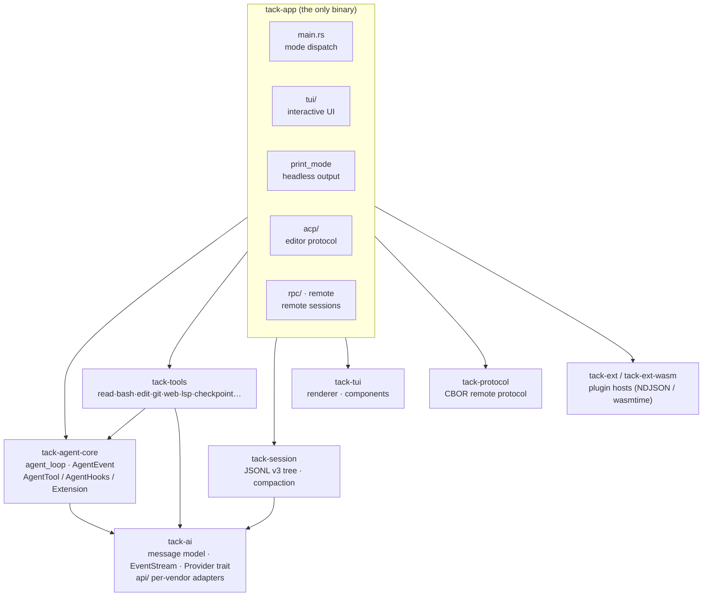
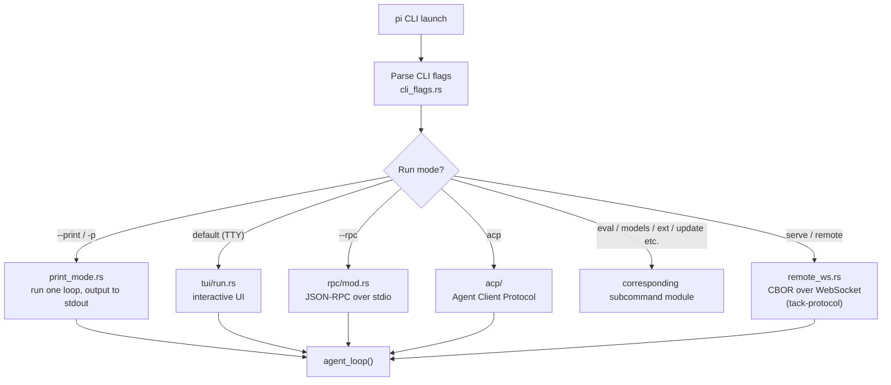
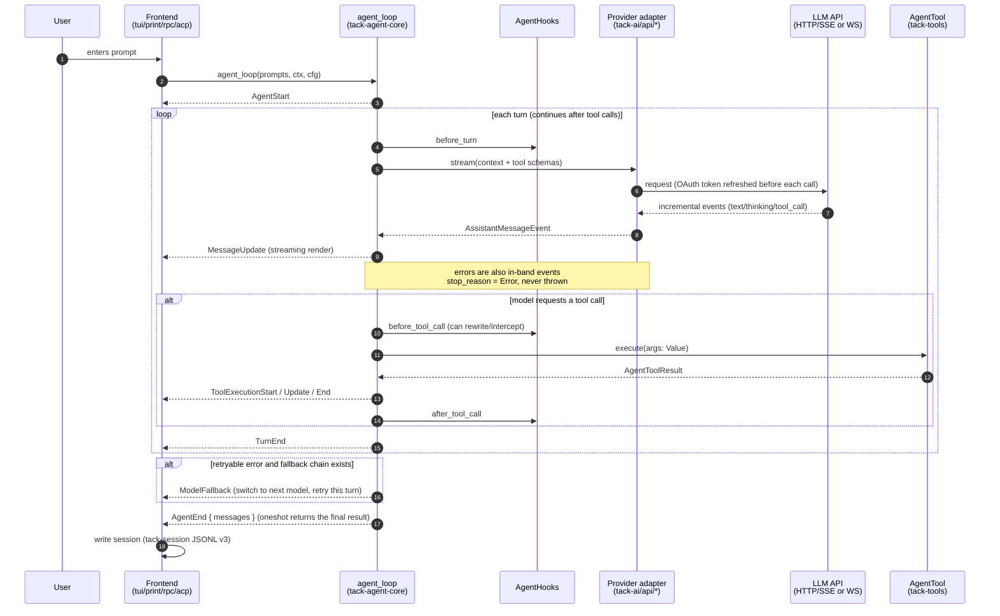
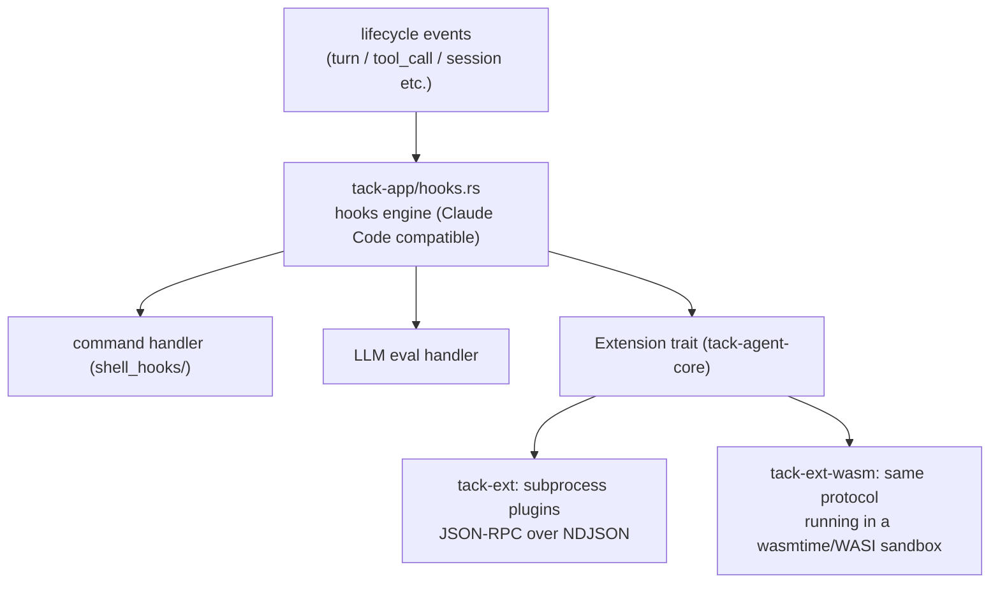

# Onboarding Guide: Source Reading Path · Feature Lookup · Flowcharts

**English | [简体中文](onboarding.zh-CN.md)**

For developers touching Tack for the first time. After reading this doc you should be able to answer three questions:

1. **Where do I start reading the code?** — Follow the "reading path" below; a full picture takes about 1–2 days.
2. **Where is the code for feature X?** — Check the "feature lookup table".
3. **How does data flow at runtime?** — See the mermaid flowcharts at the end.

> Prerequisite: `cargo build` passes (rust-toolchain.toml pins the version).
> Run it once before reading code: `cargo run -- --print "list the files in the current directory"` (print mode — the shortest end-to-end path).

---

## 1. The 30-Second Overview

Tack is a Rust reimplementation of the TypeScript pi coding agent. 9 crates with a strictly acyclic dependency direction:

```
tack-ai (message model + per-vendor LLM adapters)
   ↑
tack-agent-core (agent main loop + tool/hook/extension traits)  ←  tack-session (session persistence + compaction)
   ↑
tack-tools (built-in tool set)
   ↑
tack-app (the only binary: TUI / print / ACP / RPC / serve are all assembled here)

tack-tui (terminal UI library) · tack-protocol (CBOR remote protocol) · tack-ext / tack-ext-wasm (plugin hosts)
        ↑ the three above are only used by tack-app
```

**One iron rule**: the whole project has only two kinds of "streams" —
- `EventStream<T, R>` (tack-ai/src/stream.rs): tokio mpsc incremental events + oneshot final result;
- all provider errors are **in-band errors** (`Error` event + `stop_reason: Error`), never thrown exceptions.

Understand these two and everything else is detail.

---

## 2. Source Reading Path (bottom-up by dependency)

### Stop 1: tack-ai — message model and streams (~2 hours)

| Order | File | Lines | What to read |
|---|---|---|---|
| 1 | `crates/tack-ai/src/types.rs` | 484 | `Message` / `AssistantMessage` / `ContentBlock` / `StopReason` / `Usage` — the shared vocabulary of the whole project |
| 2 | `crates/tack-ai/src/stream.rs` | 194 | How `EventStream<T, R>` is constructed and consumed |
| 3 | `crates/tack-ai/src/provider.rs` | 105 | The `Provider` trait: the unified interface for all LLM backends |
| 4 | `crates/tack-ai/src/api/anthropic_messages.rs` | — | Pick one adapter for a close read: how SSE incremental events are translated into `AssistantMessageEvent` |
| 5 | The rest of `api/*` | — | Skim: OpenAI Completions/Responses, Google, Mistral, Codex WS, Bedrock |

**Self-check question**: when the model calls tools while still generating, what is the event order? (Hint: look at the `AssistantMessageEvent` variants)

### Stop 2: tack-agent-core — the heart of the project (~half a day)

| Order | File | Lines | What to read |
|---|---|---|---|
| 1 | `event.rs` | 81 | `AgentEvent`: everything the TUI/RPC/ACP render comes from these 10 variants |
| 2 | `tool.rs` | 105 | The `AgentTool` trait: the argument boundary is `serde_json::Value`, schemas use schemars |
| 3 | `hooks.rs` | 123 | `AgentHooks`: interception points for before/after tool call and the turn lifecycle |
| 4 | `agent_loop.rs` | 1327 | **Read closely**. Outer follow-up loop + inner tool-call/steering loop, ported directly from TS `runLoop`, with event order and error semantics fully aligned |

When reading `agent_loop.rs`, follow the file-header comment and the TS source it references (`packages/agent/src/agent-loop.ts`). Focus on: the fallback model chain (`fallback_models`), the retry-cancel scope (`retry_cancel`), and the deferred tool pool (`tool_pool`).

### Stop 3: tack-tools — what a tool looks like (~1 hour)

Read the smallest one, `read.rs`, against the `AgentTool` trait, then skim the tool registry in `lib.rs`. The rest as needed:

- Background tasks `background.rs`, checkpoints `checkpoint.rs`, memory `memory.rs`, LSP `lsp/`, sandbox `sandbox.rs`, MCP tool bridge `mcp.rs`

### Stop 4: tack-session — session persistence (~1.5 hours)

| File | What to read |
|---|---|
| `entry.rs` | `SessionEntry`: the JSONL v3 tree structure (byte-compatible with TS pi); every entry has a parent pointer |
| `context.rs` | Extract the current branch from the tree → assemble the messages sent to the model |
| `manager.rs` | Session read/write, branching, append |
| `compaction.rs` | Context compaction: `should_compact` → `find_cut_point` → LLM summary → new entry |

### Stop 5: tack-app — the assembly layer (~half a day)

1. `main.rs` (starting at the 383-line `main()`): **mode dispatch** after CLI parsing — first understand which run modes exist;
2. `print_mode.rs`: the **shortest end-to-end path** — build provider → build tools → run `agent_loop` → consume `AgentEvent` and print. Understand it and you understand 80% of the assembly logic;
3. `tui/run.rs` + `tui/chat.rs`: how interactive mode wires `AgentEvent` into the renderer;
4. Other modes as needed: `acp/` (editor protocol), `rpc/` (JSON-RPC), `remote*.rs` + tack-protocol (remote sessions), `mcp_serve.rs`.

### Stop 6: dive deeper by interest

Plugin system (`tack-ext` subprocess NDJSON protocol / `tack-ext-wasm` wasmtime sandbox) → read `docs/extensions.md` before the code; renderer and themes (`tack-tui`) → read the renderer chapter of `docs/architecture.md` first.

### Reading tips

- Each crate's `lib.rs` and most file headers carry module-level doc comments — read the comments before the code.
- To understand who consumes an event: grep for `AgentEvent::Xxx`; there are only four consumers — TUI / print / RPC / ACP.
- Differences from the TS upstream are all recorded in `docs/upstream-alignment.md`; when ported code gets hard to follow, compare against the TS original.
- This repo's `docs/` is the source of truth: architecture, configuration, features, and plugins each have a dedicated doc (see the README docs table).

---

## 3. Feature Lookup Table (feature → code → doc)

| Feature | Source location | Doc |
|---|---|---|
| Interactive TUI (themes/autocomplete/plan mode/permission dialogs) | `tack-app/src/tui/` | docs/features.md |
| Headless print mode | `tack-app/src/print_mode.rs` | README |
| ACP editor integration (Zed etc.) | `tack-app/src/acp/` | docs/features.md |
| RPC / remote sessions / serve | `tack-app/src/rpc/`, `remote*.rs`, `crates/tack-protocol` | docs/features.md |
| Built-in tools (read/bash/edit/write/git/grep/web/todo…) | `crates/tack-tools/src/` | docs/architecture.md |
| Background tasks | `tack-tools/src/background.rs` | docs/features.md |
| LSP tools | `tack-tools/src/lsp/` | docs/features.md |
| Checkpoint rollback | `tack-tools/src/checkpoint.rs` | docs/features.md |
| Persistent memory | `tack-tools/src/memory.rs` | docs/features.md |
| Subagents | `tack-app/src/subagent_tool.rs` | docs/features.md |
| Cron scheduling | `tack-app/src/cron.rs` | docs/features.md |
| Sandbox execution | `tack-tools/src/sandbox.rs` | docs/features.md |
| Permission system | `tack-app/src/permissions.rs` | docs/configuration.md |
| Lifecycle hooks (Claude Code compatible) | `tack-app/src/hooks.rs`, `shell_hooks/` | docs/hooks.md |
| Plugins (process / WASM / marketplace) | `crates/tack-ext`, `crates/tack-ext-wasm`, `tack-app/src/extension_host.rs` | docs/plugin-system.md, docs/extensions.md |
| MCP (client + serve + OAuth/elicitation/sampling) | `tack-app/src/mcp_*.rs`, `tack-tools/src/mcp*.rs` | docs/configuration.md |
| Skills / rules / resource loading | `tack-app/src/skills.rs`, `resources.rs` | docs/directories.md |
| OAuth login (PKCE / device flow) | `tack-app/src/oauth_login.rs`, `crates/tack-ai/src/oauth/` | docs/configuration.md |
| Model catalog refresh | `tack-app/src/catalog_refresh.rs` | docs/configuration.md |
| Session compaction / branch summaries | `tack-session/src/compaction.rs`, `branch_summary.rs` | docs/architecture.md |
| Eval harness | `tack-app/src/eval.rs`, `evals/` | docs/features.md |
| Self-update | `tack-app/src/self_update.rs` | docs/release.md |
| Four-layer settings precedence | `tack-app/src/settings.rs` | docs/configuration.md |
| Internationalization | `tack-app/src/i18n.rs` | — |

---

## 4. Flowcharts (mermaid)

### 4.1 Overall layering and dependency direction



### 4.2 Startup dispatch (main.rs)



### 4.3 Sequence of one conversation turn (the core of the core)



### 4.4 Session persistence and compaction

```mermaid
flowchart LR
    subgraph Write
        MSG["AgentMessage / ToolResult"] --> ENTRY["SessionEntry<br/>(with parent pointer, tree-structured)"]
        ENTRY --> JSONL["session.jsonl (v3)<br/>append-only · byte-compatible with TS pi"]
    end
    subgraph Read
        JSONL --> PATH["build_session_path()<br/>walk back from the leaf to the current branch"]
        PATH --> CTX["build_session_context()<br/>→ Vec&lt;AgentMessage&gt;"]
    end
    subgraph Compaction (compaction.rs)
        CTX --> CHECK{"should_compact()?<br/>token estimate over threshold"}
        CHECK -->|no| SEND["send to the model as-is"]
        CHECK -->|yes| CUT["find_cut_point()<br/>find a split point"]
        CUT --> SUM["call LLM to generate summary<br/>+ extract file read/write list"]
        SUM --> NEW["write compaction entry"] --> SEND
    end
```

### 4.5 Hook / plugin call chain



---

## 5. FAQ

- **Just want to add/change a tool?** Implement `AgentTool` in `tack-tools` and register it in `tack-tools/src/lib.rs`; TUI rendering styles live in `tack-app/src/tui/tool_render.rs`.
- **Want to add a new model vendor?** Add an adapter implementing `Provider` in `tack-ai/src/api/`, then register it in `providers.rs` / `catalog_refresh.rs`.
- **How to verify changes?** `cargo test -p <crate>` in the relevant crate; `cargo test --workspace` for everything (note: if linking test binaries with lld fails locally, clear `RUSTFLAGS`).
- **Compare against the TS original?** See `docs/upstream-alignment.md` — it has the repo location and the catalog refresh flow.
